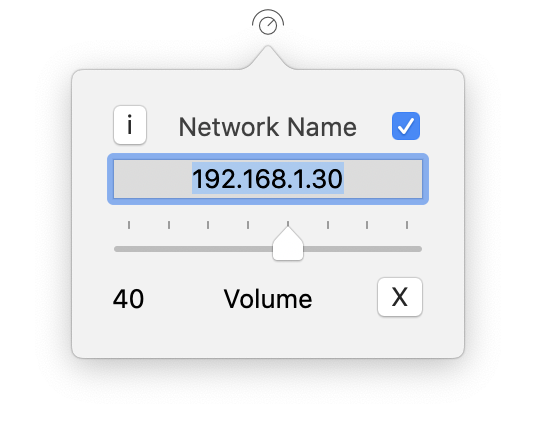

# Denon Volume

Control your Denon or Marantz receiver from the Keyboard, the Menu Bar or the Touch Bar.

## Keyboard Shortcuts

| Keyboard | Command                    |
| -------- | -------------------------- |
| ⌘+→      | Increase volume by 1 step  |
| ⌘+←      | Decrease volume by 1 step  |
| ⌘+↑      | Increase volume by 3 steps |
| ⌘+↓      | Decrease volume by 3 steps |

## Menu Bar

Enter the device IP or network name into the text field and confirm using the return key. If you have a newer AVR, you might have to include the port 8080 like in this example: `192.168.1.30:8080`.

## Touch Bar

It sits in the Control Strip.

## Download

You can download the latest version [here](https://github.com/melgu/Denon-Volume/releases).
After downloading and unpacking the Denon-Volume.zip, move the app to the Applications folder. If you get a GateKeeper warning on first launch, right-click the app, select open and confirm your action in the dialog popping up. Sometimes this needs to be done twice. Alternatively you can allow the app in System Settings -> Security.
